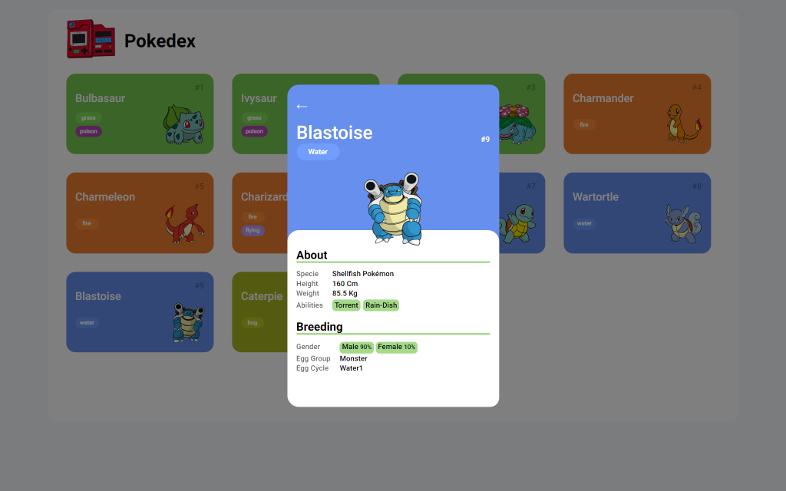

# **POKEDEX** 
## About

Pokedex app é uma aplicação desenvolvida durante o Bootcamp Santander na DIO focado no uso de HTML e CSS para o desing responsivo e agradável e no uso de JavaScript para dar vida a aplicação com os pokemons da API REST PokeApi V2.

## Layout

### Mobile e Desktop's
De telefones pequenos até tablets e de tablets até grandes monitores

**250 px - 374 px**

 

**375 px - 559 px**

 

**560 px - 899 px**

 

**900px em diante**

 
